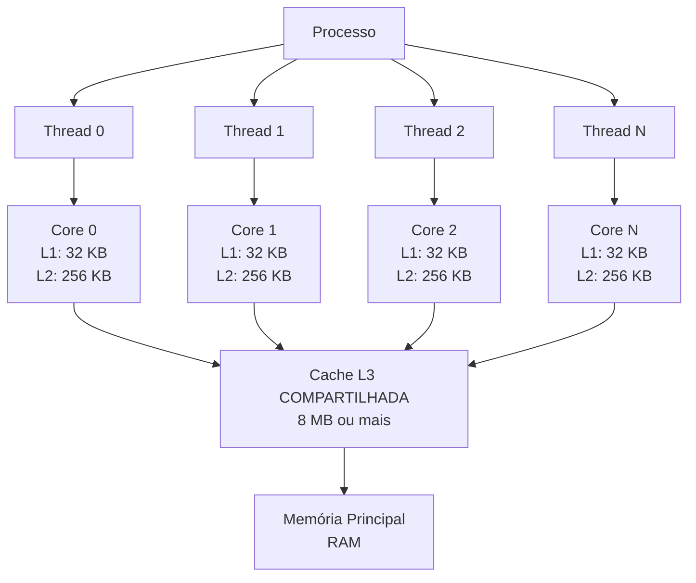

# Aula 03 - Falso compartilhamento

## Contexto

A memória cache é uma memória de alta velocidade que armazena temporariamente dados frequentemente acessados para acelerar o tempo de acesso.

Lembremos que um processo precisa de pelo menos um thread para ser executado. Cada thread pode ser executado em um núcleo de processador diferente, e cada núcleo possui sua própria cache L1 e L2. Além disso, há uma cache L3 compartilhada entre todos os núcleos do processador.



O processador opera em uma velocidade muito superior à da memória RAM (Memória Principal). A cache (L1, L2 e L3) serve como um "rascunho" de acesso ultrarrápido.

- **Cache Hit:** O sucesso na busca. O ciclo de instrução continua quase sem interrupção.

- **Cache Miss:** O fracasso na busca. O processador precisa "ficar parado" (stall) esperando os dados virem da RAM, o que pode levar centenas de ciclos de clock a mais.

Dependendo da política de cache, quando um núcleo de processador modifica um dado na cache, essa modificação pode invalidar ou atualizar as cópias desse dado em outras caches, causando um cache miss.

Se o Núcleo A altera um valor que também está na cache do Núcleo B, o sistema precisa garantir que o Núcleo B não use uma informação obsoleta. Isso é feito através de protocolos como o MESI (Modified, Exclusive, Shared, Invalid)

- **Invalidação:** A política mais comum. Quando o Núcleo A altera o dado, ele envia um sinal que marca a cópia no Núcleo B como "Inválida". Na próxima vez que o Núcleo B precisar desse dado, ocorrerá um cache miss, forçando-o a buscar o valor atualizado.

- **Atualização:** Menos comum em arquiteturas de larga escala devido ao alto tráfego de dados, mas consiste em enviar o novo valor diretamente para as outras caches.


## Problemas de compartilhamento

Os problemas de compartilhamento de cache surgem quando múltiplos threads acessam dados que residem na mesma linha de cache, mesmo que estejam acessando diferentes variáveis. Isso pode levar a invalidações frequentes da cache, resultando em desempenho degradado.

O compartilhamento de cache pode levar a dois tipos principais de problemas:

1. **Direct Sharing (Compartilhamento direto)**: ocorre quando múltiplos threads acessam e modificam a mesma variável compartilhada. 

2. **False Sharing (Falso Compartilhamento)**: ocorre quando threads em diferentes núcleos modificam variáveis que residem na mesma linha de cache. Mesmo que as variáveis sejam distintas, a modificação de uma variável pode invalidar a linha de cache para o outro núcleo, causando cache misses desnecessários.

Por exemplo, o programa `1_direct_sharing.cpp` demonstra o problema de *direct sharing*, onde dois threads incrementam uma variável global compartilhada, levando a contenção e cache misses.

Já o programa `2_false_sharing.cpp` ilustra o problema de *false sharing*, onde quatro threads incrementam contadores que estão em um `std::array`. Como os contadores estão próximos na memória, eles podem residir na mesma linha de cache. Assim, quando um thread incrementa seu contador, ele invalida a linha de cache para os outros threads, resultando em desempenho degradado.

## Soluções para problemas de compartilhamento

Para mitigar os problemas de compartilhamento de cache, podemos adotar as seguintes estratégias:

1. **Padding (Preenchimento)**: Adicionar bytes extras entre variáveis para garantir que elas não compartilhem a mesma linha de cache. Isso pode ser feito manualmente ou utilizando estruturas de dados que suportam alinhamento.

2. **Cópia local e agregação**: Cada thread mantém uma cópia local dos dados que precisa modificar e, ao final, agrega os resultados em uma variável compartilhada. Isso reduz a frequência de acessos à variável compartilhada.

O programa `3_no_sharing.cpp` implementa a solução de padding, onde cada contador não são mais inteiros simples, mas uma estrutura `AlignedAtomic` que é alinhada a 64 bytes (tamanho típico de uma linha de cache).

```cpp
// Contador alinhado
struct AlignedAtomic
{
    alignas(64) std::atomic<int> counter = 0;
};

// Vetor de contadores alinhados
std::array<AlignedAtomic, 4> counters;
```

Dessa forma, cada contador reside em sua própria linha de cache, eliminando o falso compartilhamento.

## A ferramenta `perf`

Utilizada para medir o desempenho de programas em sistemas Linux. Para instalá-la em distribuições baseadas em Debian/Ubuntu, você pode usar o seguinte comando:

```bash
sudo apt-get install linux-tools-common linux-tools-generic linux-tools-$(uname -r)
```

Para contar quantas vezes eventos específicos ocorreram durante a execução

```bash
perf stat -d ./nome_do_programa.out
```

Algumas métricas importantes são

- Instructions per cycle (IPC): Indica quão eficiente o código é (quantas instruções o processador executa por batida de clock).
- L1-dcache-load-misses: Número de vezes que o processador tentou ler dados da cache L1, mas não os encontrou (cache miss).
- LLC-load-misses: Número de vezes que o processador tentou ler dados da cache L3, mas não os encontrou (cache miss).

Para analisar problemas de compartilhamento, o `perf c2c` pode ser utilizado da seguinte forma

```bash
# Monitora o programa em execucao
perf c2c record ./nome_do_programa.out

# Transforma os dados coletados em um relatório legível
perf c2c report
```

A principal métrica do C2C é o Hit Modified (HITM), que indica quantas vezes um núcleo teve que esperar por dados modificados por outro núcleo devido a compartilhamento de cache.

Ao abrir o relatório, você verá uma lista de endereços de memória (Cache Lines). Foque nas seguintes colunas

- LLC Misses / HITM: Esta é a coluna mais importante. Ela mostra quantas vezes ocorreu o conflito de cache.
- Total HITM: O número total de vezes que uma linha de cache teve que ser movida entre núcleos porque foi modificada.
- Rmt HITM (Remote HITM): Indica que o conflito ocorreu entre núcleos de processadores físicos diferentes (NUMA nodes). Isso é extremamente custoso para a performance.
- Lcl HITM (Local HITM): O conflito ocorreu entre núcleos do mesmo processador. É ruim, mas menos lento que o remoto.

## Tempos de execução

Compare os tempos de execução entre os programas `2_false_sharing.cpp` e `3_no_sharing.cpp` para observar o impacto do falso compartilhamento no desempenho.

```bash
# Comparação entre falso compartilhamento e sem compartilhamento
time ./2_false_sharing.out
time ./3_no_sharing.out
```

Abaixo os resultados obtidos em um sistema com 16 núcleos