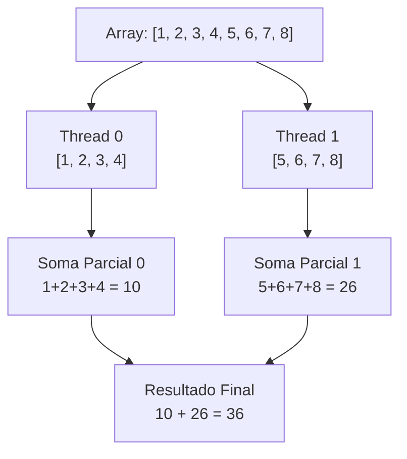

# Aula 18 - Redução em OpenMP

## Visão geral

A redução é um termo usado em programação para descrever a operação de combinar múltiplos valores em um único valor agregado. 

Esta operação pode ser somar, multiplicar, encontrar o máximo ou mínimo, entre outras operações. 

No contexto de programação paralela, a redução é feita de forma que múltiplas threads possam colaborar para computar o valor agregado de maneira eficiente. Isso é um desafio porque envolve a coordenação entre threads para garantir que os resultados parciais sejam combinados corretamente sem causar condições de corrida ou inconsistências nos dados.

Por exemplo, considere o problema de calcular a soma de um grande array de números. Em uma abordagem sequencial, você simplesmente iteraria sobre o array e somaria cada elemento. No entanto, em uma abordagem paralela, você pode dividir o array em partes menores, atribuir cada parte a uma thread diferente para calcular a soma parcial e, em seguida, combinar essas somas parciais para obter o resultado final.



Note que a agregação das somas parciais em uma variável compartilhada (`resultado_final += soma_parcial`) pode causar condição de corrida se não for sincronizada adequadamente. 

## Cláusula `reduction`

Em OpenMP, a cláusula `reduction` é usada para especificar variáveis que serão reduzidas ao final da execução paralela.

Sua sintaxe básica é a seguinte

```c++

#pragma omp parallel reduction(operador: variável)
{
    // Código paralelo que modifica a variável
}
```

Essa agregação é feita de forma que cada thread tenha sua própria cópia da variável de redução, evitando condições de corrida. No final da região paralela, as cópias são combinadas usando o operador especificado.