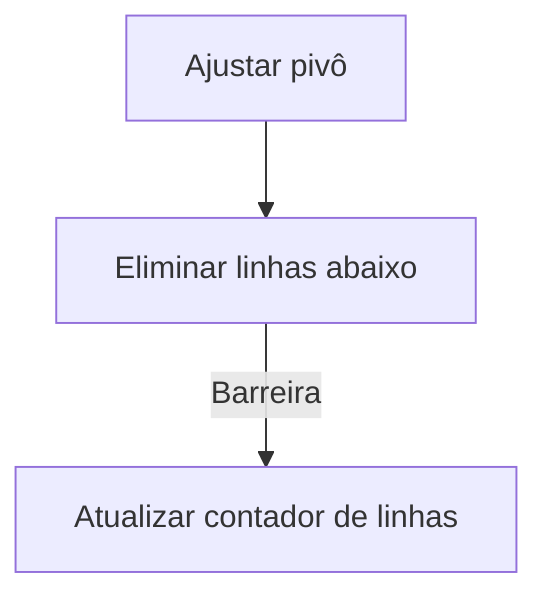

# Aula 20 - Diretiva nowait em OpenMP

## Visão geral

Existem situações em que queremos que as threads em uma região paralela continuem a executar sem esperar que todas as outras threads terminem suas tarefas. A diretiva `nowait` em OpenMP permite que as threads prossigam sem esperar pela conclusão de outras threads em certas construções, como `for`, `sections` e `single`.

## Exemplo

O programa `0_baseline.cpp` mostra a versão paralelizada do programa da Eliminação Gaussiana usando as cláusulas `single` e `for` em uma mesma região paralela.

A presença da barreira que obriga as threads a esperar as outras processarem as demais linhas abaixo do pivô antes de prosseguir para a próxima iteração é um gargalo de desempenho, porque as threads que terminam mais cedo poderiam começar a trabalhar na próxima iteração.

Para resolver esse problema, podemos usar a diretiva `nowait` para eliminar a barreira implícita após a diretiva `for`. Isso permite que as threads que terminam suas tarefas mais cedo possam continuar para a próxima iteração sem esperar pelas outras threads.

